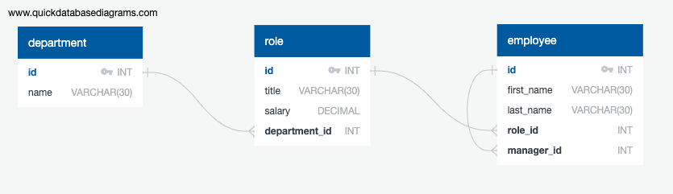

# EmployeeTracker

This is a CLI application for a company to view and manage the departments, roles, and employees in the company to organize and plan the business. This application utilizes Inquirer, MySQL2 and DotENV.

## Installation

Use the command line to install the dependencies needed for this application.

```bash
npm i
```

## Usage

To begin, create a unique .env file to fill out your own username, password. The database name is "employee_tracker_db". Once synced up, run the command `node server.js` to kick off the application. Follow the series of prompts to use the app. When finished, click on `Exit` to end the session. Please refer to the image of the dabase schema to better understand the functionality of the app.

[]

Please also refer to the walkthrough video for further explanation of usage.

(https://drive.google.com/file/d/14sEn1bVm86_mc0yeBqNWNKlbF9rLUWi_/view)

## Contributing

Pull requests are welcome. For major changes, please open an issue first
to discuss what you would like to change.

Please make sure to update tests as appropriate.

## License

[MIT](https://choosealicense.com/licenses/mit/)
